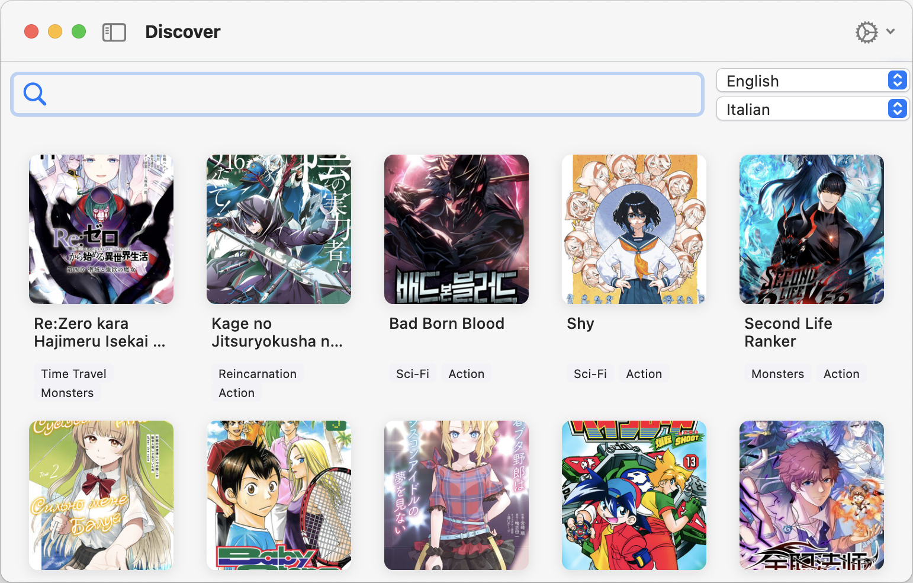

# Flutter Manga Multi Language Viewer

Read and compare manga across multiple translations, side by side.

## ✨ Features

- 🔎 **Search MangaDex**  
Browse the [MangaDex](https://mangadex.org) catalog by title.  
Filter results by one or more languages.

- 📚 **Browse Chapters**  
  View available chapters per language.  
  Select two translations of the same chapter to compare.

- 📖 **Dual-Language Reader**  
  Overlay two translations of a manga chapter.   
  - Toggle layers with the spacebar.  
  - Zoom and pan with smooth controls.  

create-dmg --overwrite --volname "MangaMuliLanguageViewer" \
  "MangaMuliLanguageViewer-macOS.dmg" "Manga Muli Language Viewer.app"
## 🎥 Demo

[](./assets/screen_cap.mp4)  
*Click the image to watch a short demo video.*


## 🚀 Getting Started

1. **Install Flutter**  
   Make sure you have [Flutter](https://docs.flutter.dev/get-started/install) set up.

2. **Clone this repo**  
   ```bash
   git clone https://github.com/AlexKimmel/manga_multi_language_viewer.git
   cd flutter-manga-translator

3.	**Install dependencies**
    ``` bash 
    flutter pub get
    ```

4. **Run the app**
    ```
    flutter run 
    ```

## 🖱️ Usage

- **Search**: Enter a title and filter by language(s).  
- **Pick a chapter**: Choose a chapter that is translated in both languages
- **Read**: Pages are overlaid; press space to reviel the alternative translation
- **Controls**:
  - Spacebar → toggle top translation fully on/off  
  - Scroll / pinch → zoom and pan  

---

## 🔧 Roadmap
- Proper windows port 
- Anki integration for vocab cards  
- Offline caching of chapters  
- Additional reader modes (side-by-side panels, vertical scroll)  

---

## ⚠️ Disclaimer

This app does not host manga content. It uses the MangaDex API to fetch publicly available scanlations.  
Please respect scanlation groups’ work and MangaDex’s terms of service.